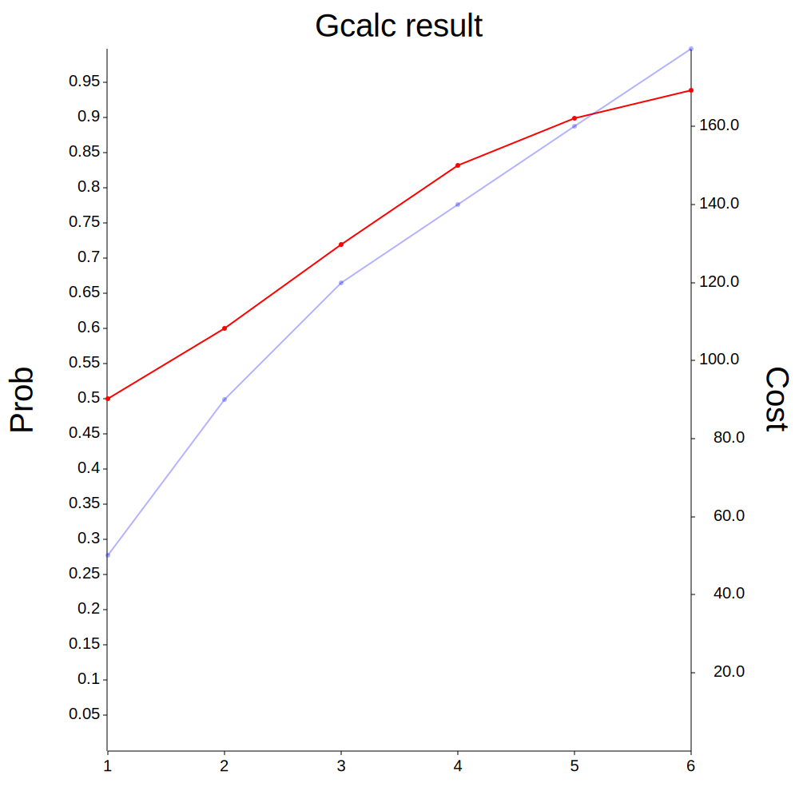

# Gcalc

Gcalc is a game probability calculator.

Gcalc is not merely a gacha simulator but more of a generic probability
calculator.

## Usage

```bash
# Basic
gcalc <SUBCOMMAND> <OPTIONS>

# SUBCOMMANDS:
#   cond         Conditional calculation
#   qual         Conditional calculation but only prints result
#   range        Prints range of calculations
#   reference    Create a reference file
#   option       Create an option file

# For cond and qual
-b, --budget <budget>          Budget of total cost
-C, --cost <cost>              Cost per try

# For range
-c, --count <count>            Counts to execute
-S, --start <start>            Starting index to print

# Global option
    --constant <constant>      Constant value to be added into probability
-f, --format <format>          Table format(csv|console|gfm)
    --fallback <fallback>      Set csv value fallback {rollback|ignore|none} [default: none]
-h, --help                     Print help information
-l, --column <column>          Column mapping
    --noheader                 CSV without header
-o, --out <FILE>               File to write output
-O, --option <option>          Option file to use
-p, --probability <prob>       Basic probability
-P, --precision <precision>    Precision
-r, --ref <reference>          Reference file
    --refin                    Reference from stdin
-s, --strict                   Set strict CSV reader mode, every try should be corresponding csv record.
-t, --target <target>          Target probability to achieve
-T, --type <probtype>          Probability type(percentage|fraction)
--plot						   Create plot vector graphics named as "out.svg"
```

## Install

**binary**
```bash
cargo install gcalc --features binary --locked
```

**libary**
```toml
[dependencies]
gcalc = "0.2.0"
```

## Demo

```bash
# Print records of probability 0.2(20%) with budget of 100 and cost of 20 for each iteration.
# Target probability is 0.6
gcalc cond --probability 0.2 --budget 100 --cost 20 -f console --precision 2 -T percentage -t 0.6

# Print from 0 to 10 as github markdown formatted table, which has a precision of
# 2 digits. Each try has cost of 1000.
gcalc range --probability 0.2 --count 10 --format gfm --precision 2 --cost 1000

# Print probability changes illustrated as csv formatted table, which has a
# precision of 2 digits. Target probability is 0.8.
gcalc cond --probability 0.2 --format csv --precision 2 --target 0.8

# Print how many counts are required to reach 0.99 probability with 0.01 change of each try
# Qual subcommand uses geometric-series formula if no reference was given as an argument
# Which is efficient for very small probability cases
gcalc qual --probability 0.001 -f gfm --target 0.99 --precision 2

# Use reference file 
gcalc <SUBCOMMAND> --ref ref.csv

# Use reference from stdin
cat ref.csv | gcalc <SUBCOMMAND> --refin

# Read options from option file
gcalc range --option option.json
```

Results of prior usages are,

```bash
# gcalc cond --probability 0.2 --budget 100 --cost 20 -f console --precision 2 -T percentage -t 0.6
+-------+-------------+------+
| count | probability | cost |
+-------+-------------+------+
|   1   |   20.00%    |  20  |
+-------+-------------+------+
|   2   |   36.00%    |  40  |
+-------+-------------+------+
|   3   |   48.80%    |  60  |
+-------+-------------+------+
|   4   |   59.04%    |  80  |
+-------+-------------+------+
|   5   |   67.23%    | 100  |
+-------+-------------+------+

# gcalc range --probability 0.2 --count 10 --format gfm --precision 2 --cost 1000
| count | probability | cost  |
|-------+-------------+-------|
|   1   |    0.20     | 1000  |
|   2   |    0.36     | 2000  |
|   3   |    0.48     | 3000  |
|   4   |    0.59     | 4000  |
|   5   |    0.67     | 5000  |
|   6   |    0.73     | 6000  |
|   7   |    0.79     | 7000  |
|   8   |    0.83     | 8000  |
|   9   |    0.86     | 9000  |
|  10   |    0.89     | 10000 |

# gcalc cond --probability 0.2 --format csv --precision 2 --target 0.8
count,probability,cost
1,0.20,0.0
2,0.36,0.0
3,0.48,0.0
4,0.59,0.0
5,0.67,0.0
6,0.73,0.0
7,0.79,0.0
8,0.83,0.0

# gcalc qual --probability 0.001 -f gfm --target 0.99 --precision 2
| count | probability | cost |
|-------+-------------+------|
| 4602  |    0.99     |  0   |
```

**Reference file example**
```csv
count,probability,constant,cost
1,0.1,0,50
2,0.2,0,40
3,0.3,0,30
4,0.4,0,20
5,0.5,0,10
```

**option file example**

```json
{
	"count": 10,
	"prob_type": "Percentage",
	"prob_precision": 2,
	"budget": null,
	"fallback": "None",
	"no_header": false,
	"strict": false,
	"target": null,
	"column_map": {
		"count": 0,
		"probability": 1,
		"constant": 2,
		"cost": 3
	},
	"format": "GFM",
	"csv_ref": {
		"File": "ref.csv"
	},
	"out_option": "Console"
}
```
"csv\_ref" is a tuple which has variant of...
```
"csv_ref" : {
	"Raw" : "count,probability,constant,cost
1,0.1,0.0,10"
}

or

"csv_ref" : {
	"File": "file_name_in_string"
}

or

"csv_ref" : "None",
```

## Advanced usage

**Column mapping**

You can read existing csv file without changing order of original source with
column option. You can type any character if given colun is not used by gcalc.

Currently, reference csv **requires all count,cost,probability,constant
columns**. This behaviour might change in the future though.

Default order of columns are

- count
- probability
- constant
- cost

```bash
# Example csv content...
db,type,count,constant,cost,probability
t1,a,1,0.1,30,0.1
t1,b,2,0.1,20,0.1
t1,c,3,0.1,10,0.1
t1,a,4,0.2,30,0.1
t1,b,5,0.2,20,0.2
t1,c,6,0.2,10,0.3

# Example usage
gcalc --ref ref.csv range --count 6 --column db,type,count,constant,cost,probability

# You can also write as
gcalc --ref ref.csv range --count 6 --column ,,count,constant,cost,probability
```

**Strict Read**

Gcalc doesn't match every try for corresponding reference's record by default.

```bash
# Example csv file
count,probability,constant,cost
1,0.5,0,50
2,0.2,0,40
3,0.3,0,30
4,0.4,0,20
5,0.5,0,10

# Range from 1 to 10
# From 6th try, 5th record values are used
gcalc range --count 10 --ref ref.csv 
```

User can disable this behaviour with strict flag

```bash
gcalc range --count 10 --ref ref.csv --strict

# Previous command yields error
Invalid csv error
= Empty row in index: 6
```

**Fallback**

Gcalc tries to parse CSV value as intended data type. But user can define
fallback behaviour for such situations.

```bash
# Example csv file
count,probability,constant,cost
1,0.5,0.2,50
2,0.2,-,40
3,0.3,0.1,30
4,0.4,-,20
5,0.5,-,10

# Default value is 'none'
# Option is case insensitive, btw
gcalc <SUBCOMMAND> --ref ref.csv --constant 0.7 --fallback rollback|ignore|none
```
On previous example, at the third record which is ```3,0.3,0.1,30```

- Rollback : Set constant as 0.7 which is an initial value given as argument
- Ignore   : Set constant as 0.2 which is the updated value of constant.
- None     : Panics and abort a program

## Demo plot image



## About

### Why not use a simple formula?

Well because, real life usages are not clear cut demonstrated geometric
sequences. Sometimes there is bonus for a specific gacha stage and there is
also a so-called confirmed gacha system, which makes it hard to use geometric
series formula. 

### Ok, why not use other gacha simulators or calculators?

First, simulation is not calculation. The major reasoning of this crate is
about expectation and calibration, especially game development in mind.

Second, existing calculators only consider fixed value of probability. However
there are plenty of contents that utilize bonus probability on specific steps
and there are some gachas that have different probability for different
situations.

Third, those are hard to integrate with other systems. Most of them are either
simple programs with integrated front end (GUI) which can be only losely
connected to other game development tools at the most and automation is
nearly impossible.


## Goal

- Easily usable binary and library for probability check and calculations
- Easy automation with csv files
- Multi format: cross-platform binary + wasm binary
- Integration with jupyter notebooks
